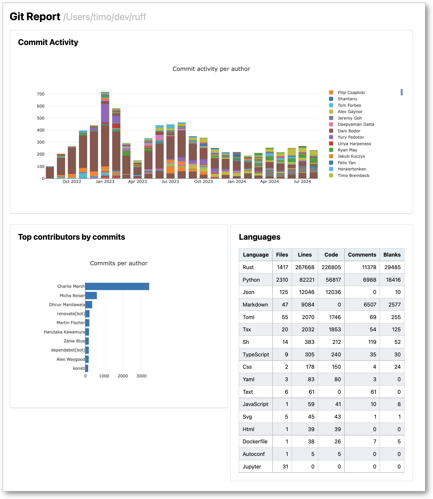

# git-report
Get a report on a git repository.

## Goals
- Show activity over time
- Show languages used
- Show contributor activity

## Installation
Make sure you've installed cargo, follow the instructions [here](https://doc.rust-lang.org/cargo/getting-started/installation.html).
Note that you need to add `$HOME/.cargo/bin` to your `$PATH`.

Then run the following command:
```shell
cargo install --git https://github.com/timotk/git-report
```

## Usage
```shell
git-report /path/to/repo
```

This will open a browser window with the report.

## Example report

